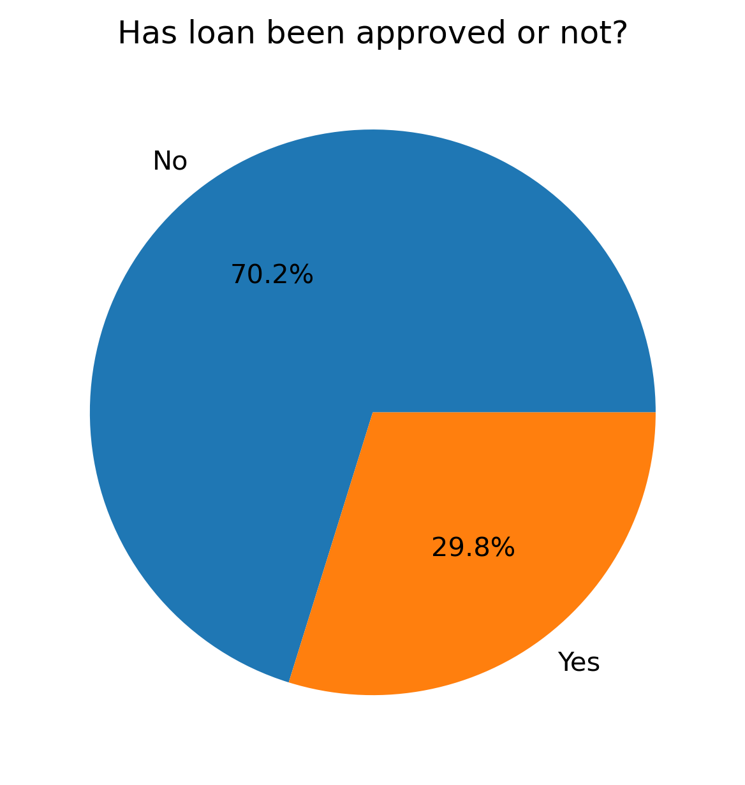
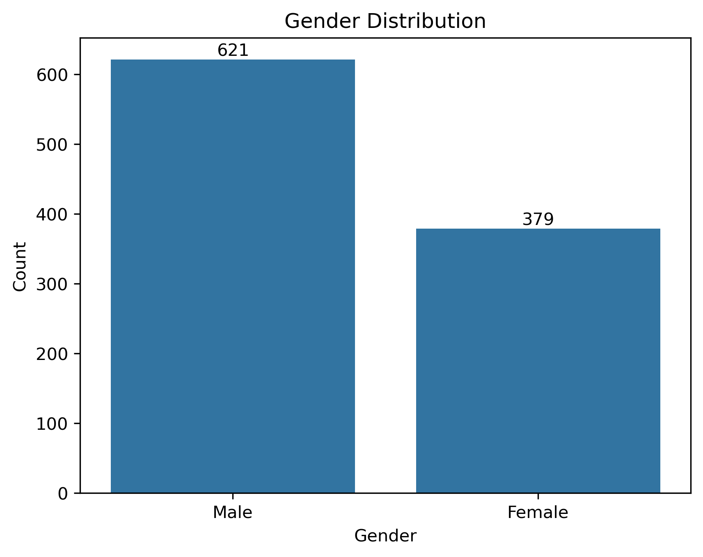
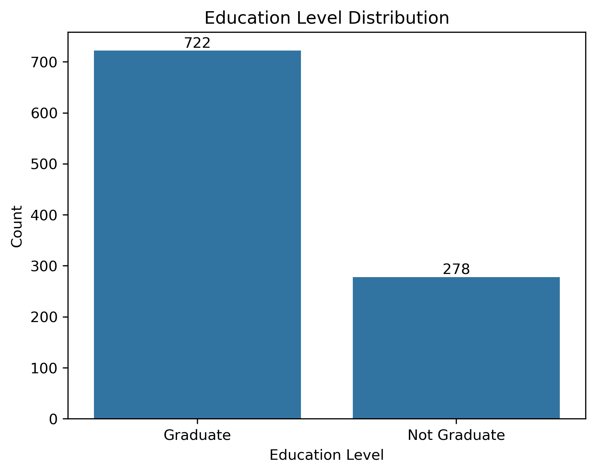
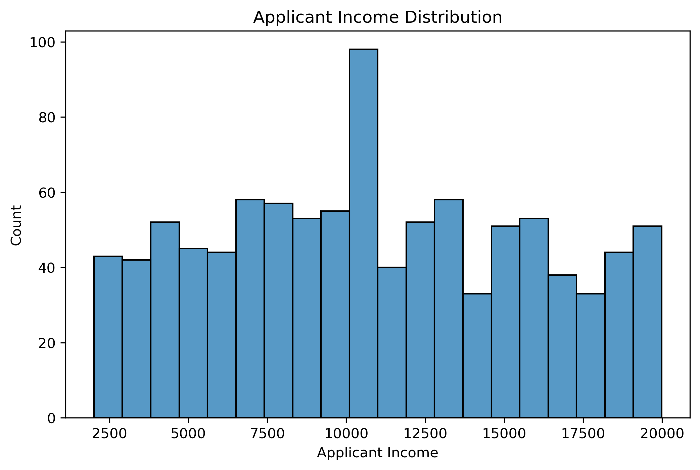
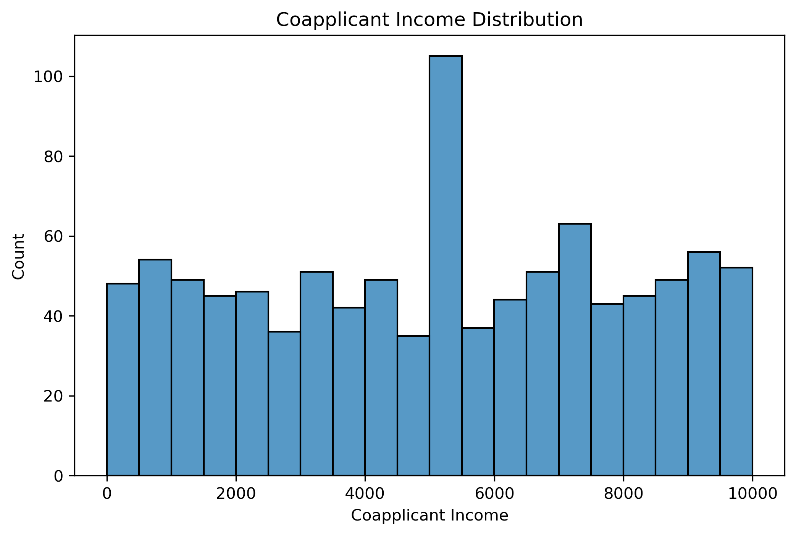
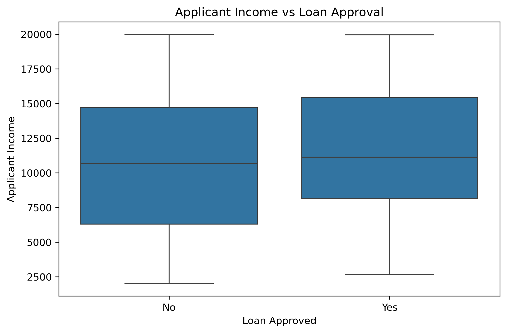
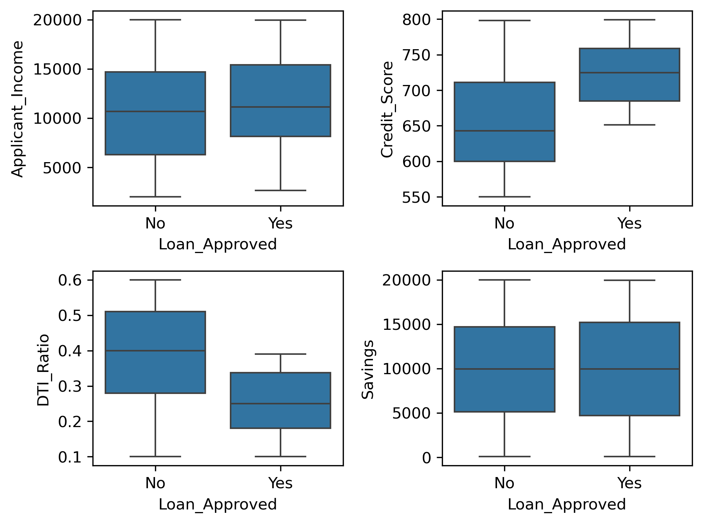
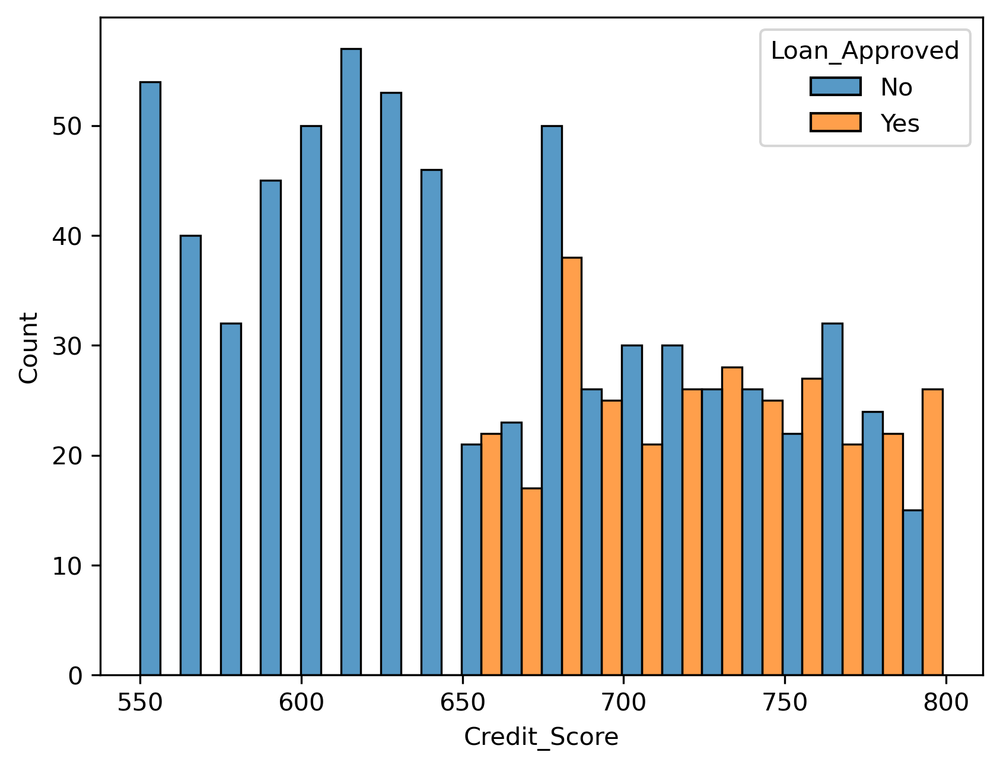
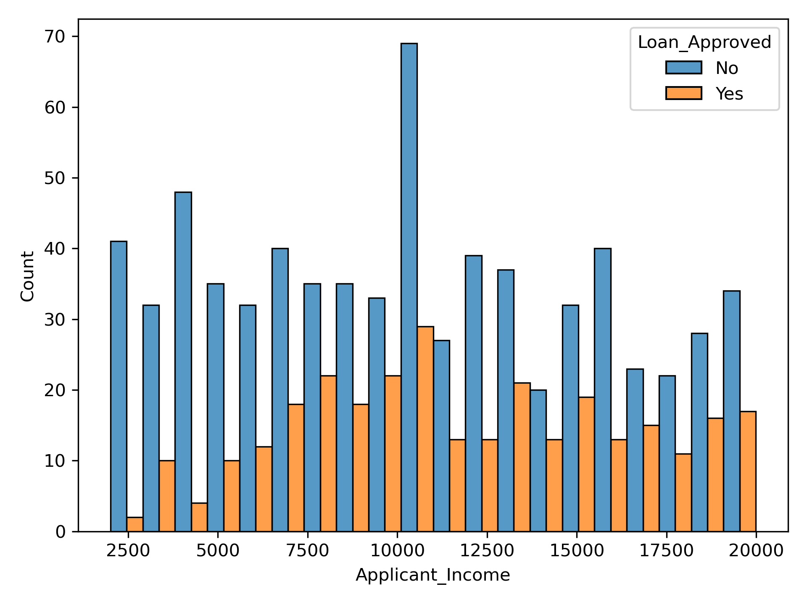
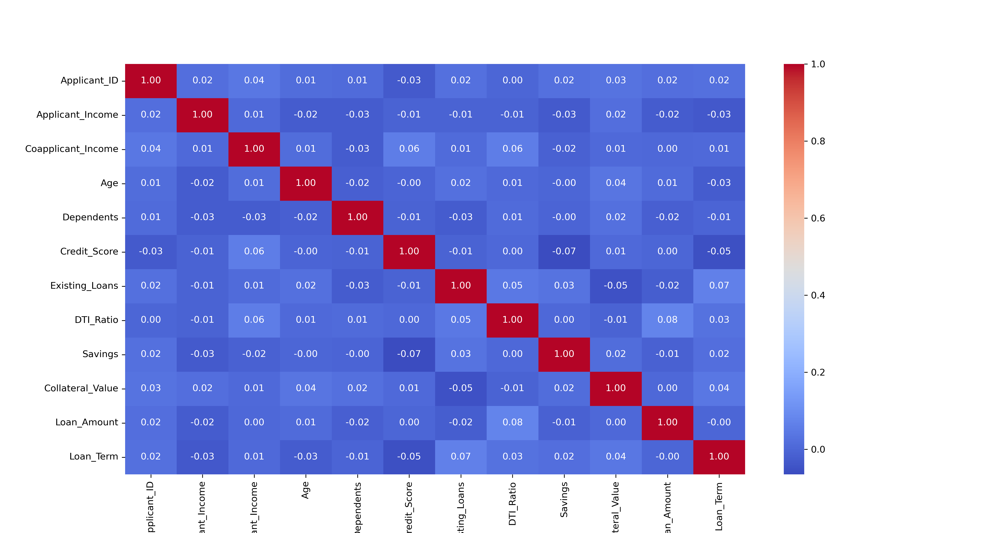

<h1 align="center">💳 CreditWise Loan Approval Prediction</h1>

<p align="center">Supervised ML pipeline for Loan Approval Classification using Logistic Regression, KNN and Naive Bayes</p>

<p align="center">
  
  
  
  
  
  
  
</p>

## Overview

CreditWise Loan Approval Prediction is a supervised machine learning project designed to predict whether a loan application will be approved based on an applicant's financial, demographic, employment, and credit-related attributes.

The project follows an end-to-end machine learning workflow, including data inspection, preprocessing, exploratory data analysis, feature engineering, feature scaling, model development, and performance evaluation.

Multiple classification algorithms are implemented and compared to understand their effectiveness in predicting loan approval outcomes.

---

## Objective

Loan approval decisions depend on several interacting factors such as income, credit score, existing loans, debt-to-income ratio, savings, collateral value, employment characteristics, and loan requirements.

The objective of this project is to develop a machine learning-based classification system that can learn patterns from historical loan applications and predict the approval status of new applications.

The project also focuses on:

- Understanding the relationship between applicant characteristics and loan approval.
- Handling missing and inconsistent data.
- Identifying important patterns through exploratory data analysis.
- Engineering meaningful features from existing variables.
- Comparing multiple supervised learning algorithms.
- Evaluating models using classification-specific performance metrics.

---

## Dataset

The dataset contains **1,000 loan application records** with **20 columns**, consisting of:

- **18 predictor variables**
- **1 applicant identifier**
- **1 target variable**

The target variable is:

`Loan_Approved`

The target contains two classes:

- `Yes` — Loan Approved
- `No` — Loan Not Approved

### Key Features

The dataset contains financial, demographic, employment, and loan-related information such as:

- Applicant Income
- Coapplicant Income
- Credit Score
- Existing Loans
- DTI Ratio
- Savings
- Collateral Value
- Loan Amount
- Loan Term
- Loan Purpose
- Property Area
- Employment Category
- Gender
- Education Level
- Marital Status
- Age
- Dependents
- Employer Category

The dataset contains **950 labelled records**, with the remaining records requiring appropriate handling during the preprocessing stage.

---

# Workflow

## 1. Data Loading and Inspection

- Loaded the loan application dataset using Pandas.
- Examined the structure and data types using `df.info()`.
- Inspected statistical properties using `df.describe()`.
- Identified missing values and categorical variables.
- Examined the distribution of the target variable.

---

## 2. Data Cleaning

The dataset was cleaned before model development.

The following preprocessing operations were performed:

- Identified missing values in numerical and categorical features.
- Applied mean/median imputation to numerical variables where appropriate.
- Applied most-frequent imputation to categorical variables.
- Checked for duplicate or inconsistent records.
- Prepared categorical variables for subsequent encoding.

---

## 3. Exploratory Data Analysis

Exploratory Data Analysis (EDA) was performed to understand the underlying structure of the dataset.

The analysis included:

- Loan approval class distribution.
- Applicant demographic distributions.
- Income-related distributions.
- Credit score analysis.
- Education-level distribution.
- Gender distribution.
- Correlation analysis between numerical variables.
- Outlier analysis.
- Relationship between financial attributes and loan approval.

Visualizations were generated using Matplotlib and Seaborn and are stored in the `plots/` directory.

---

## 4. Feature Engineering

Additional features were created to capture potentially important non-linear relationships within the dataset.

The feature engineering process included:

- Squared DTI Ratio:

  `DTI_Ratio²`

- Transformed Credit Score:

  `Credit_Score²`

- Log-transformed Applicant Income:

  `log(Applicant_Income)`

These engineered features were introduced to improve the ability of classification models to capture non-linear relationships between applicant characteristics and loan approval.

---

## 5. Data Preprocessing

Before model training:

- Removed irrelevant identifier columns.
- Encoded categorical variables.
- Converted categorical information into numerical representations suitable for machine learning.
- Standardized numerical features using `StandardScaler`.
- Prepared the final feature matrix for model training.

---

## 6. Train-Test Split

The processed dataset was divided into training and testing subsets.

The training set was used to develop the classification models, while the test set was kept separate for evaluating their performance on unseen data.

---

## 7. Machine Learning Models

Three supervised classification algorithms were implemented and compared:

### Logistic Regression

Logistic Regression was used as a linear classification baseline for predicting binary loan approval outcomes.

### K-Nearest Neighbors (KNN)

KNN was implemented as a distance-based classification approach. Feature scaling was applied before model training to ensure that variables with larger numerical ranges did not dominate the distance calculations.

### Gaussian Naive Bayes

Gaussian Naive Bayes was implemented as a probabilistic classification model based on Bayes' theorem and the assumption of conditional independence between features.

---

## 8. Model Evaluation

The trained models were evaluated using multiple classification metrics:

- Accuracy
- Precision
- Recall
- F1-Score
- Confusion Matrix

Using multiple evaluation metrics provides a more comprehensive understanding of model performance than accuracy alone.

### Evaluation Metrics

**Accuracy**

Measures the proportion of correctly classified observations.

**Precision**

Measures the proportion of predicted positive cases that are actually positive.

**Recall**

Measures the proportion of actual positive cases correctly identified by the model.

**F1-Score**

Provides a harmonic mean of precision and recall.

**Confusion Matrix**

Provides a detailed breakdown of:

- True Positives
- True Negatives
- False Positives
- False Negatives

---

# Visualizations

The project includes several visualizations generated during the exploratory data analysis and model evaluation stages.

The plots are stored in the `plots/` directory.

### 1. Loan Approval Distribution

Shows the distribution of approved and non-approved loan applications.



### 2. Gender Distribution

Shows the distribution of applicants across different gender categories.



### 3. Education Level Distribution

Shows the distribution of applicants according to their education level.



### 4. Applicant Income Distribution

Shows the distribution of applicant income values in the dataset.



### 5. CoApplicant Income Distribution

Shows the distribution of co-applicant income values in the dataset.



### 6. Applicant Income vs Loan Approval

Visualizes the relationship between applicant income and loan approval status.



### 7. Loan Approved Boxplots

Uses boxplots to compare the distribution of relevant numerical features based on loan approval status.




### 8. Credit Score Distribution

Shows the distribution of credit scores among the loan applicants.



### 9. Applicant Income by Loan Approval

Compares applicant income levels across approved and non-approved loan applications.



### 10. Correlation Heatmap

Displays the correlation between numerical financial and credit-related variables.



---

## Project Structure

```text
CreditWise_Loan_Approval_Prediction/
│
├── loan_approval_data.csv
├── loan_system.ipynb
├── README.md
├── requirements.txt
├── .gitignore
├── .gitattributes
│
└── plots/
    ├── applicant_income_by_loan_approval.png
    ├── applicant_income_distribution.png
    ├── applicant_income_vs_loan_approval.png
    ├── coapplicant_income_distribution.png
    ├── correlation_heatmap.png
    ├── credit_score_distribution.png
    ├── education_level_distribution.png
    ├── gender_distribution.png
    ├── loan_approved_boxplots.png
    └── loan_approval_distribution.png
